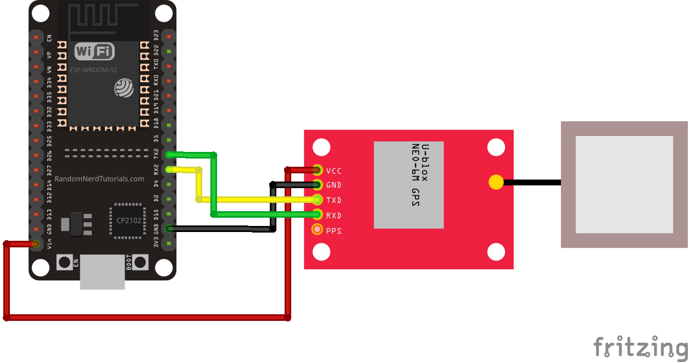
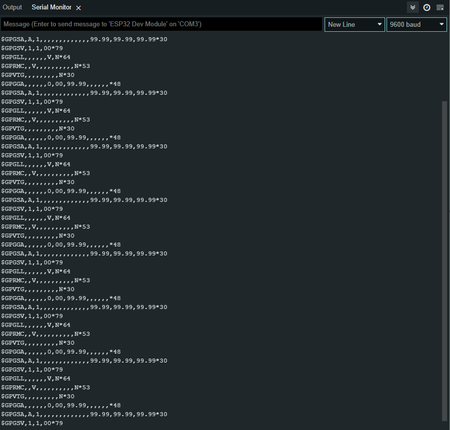

# ESP32_GPS_Neo_6m
Getting started using GPS Ublox Neo 6m on ESP32 Development Board.  
This tutorial's gonna show us how to get started GPS module by reading its raw data to display.

# Wiring Diagram
VCC : 3v3 pin at ESP32  
RX  : TX2 pin at ESP32  
TX  : RX2 pin at ESP32  
GND : GND pin at ESP32  

# Output
Even the GPS LED's not blinking, It'll still show some raw data.  
This output example's showing if your GPS module ready to use.

